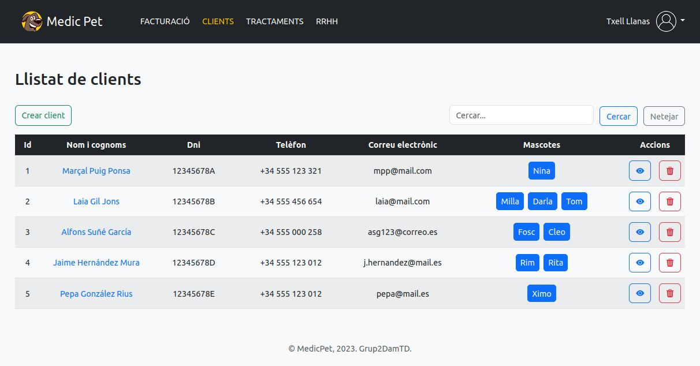
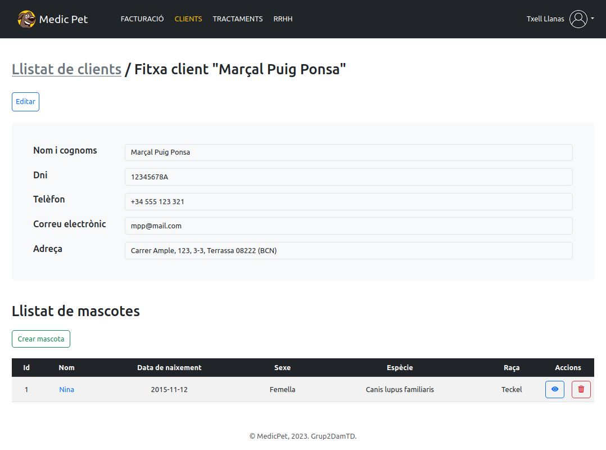

<h1>MedicPet</h1>
<h3>ERP per a clíniques veterinàries</h3>

**MedicPet** facilita la direcció d’una clínica veterinària aplicant les millors tecnologies d’administració per maximitzar així els beneficis de l’empresari i millorar la posició de la clínica dins el mercat local, fent que l’atenció als clients millori notablement a través de la rapidesa de consulta de dades i de la consulta personalitzada. 
 

Aquest sistema consta actualment de tres mòduls de gestió: *treballadors*, *tractaments* i *clients*. Cadascun d'aquests mòduls és fonamental per al funcionament correcte de la clínica:
- El **mòdul de treballadors** permet gestionar tot el personal de la clínica, des dels veterinaris fins als administratius.
- El **mòdul de tractaments** permet gestionar els tractaments i medicaments que s'utilitzen a la clínica.
- El **mòdul de clients** permet gestionar els propietaris de les mascotes que visiten la clínica.
 

A continuació, s'enllaça el nostre vídeo promocional i algunes captures de l'aplicació.

 
<h2> &nbsp;Vídeo promocional</h2>

 

 
<h2> &nbsp;Captures de pantalla</h2>
<table style="width:100%">
<tr>
    <td> 
      
    </td>
</tr>
<tr>
    <td> 
      
    </td>
  </tr>
</table>
 

<h2> &nbsp;Memòria del projecte</h2>
Si vols més info del nostre projecte fés clic <b><a href="https://docs.google.com/document/d/1iikoBaWo5pCM9ZRAi2OOydrg5M0nSWlB/edit?usp=share_link&ouid=117921927369061213080&rtpof=true&sd=true">aquí</a></b>!
